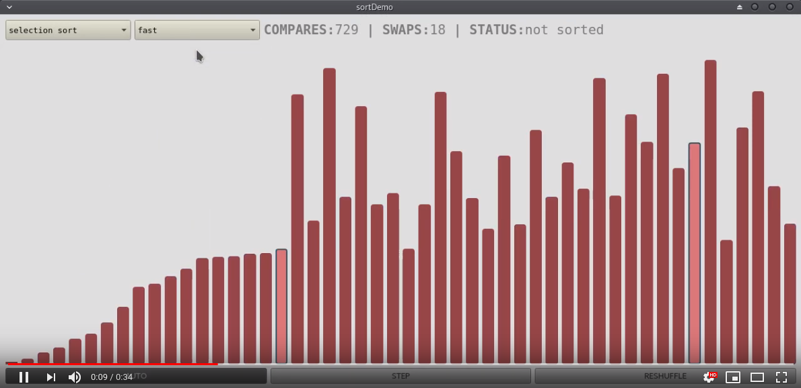

# sortDemo
Sorting algorithms visual display tool.

[](https://youtu.be/ZLtREpDUUC4)

This little toy software provides visual representation of virtually any sorting algorithm based on compare and swap operations.

It is built over a QT GUI QWidget and a custom class implementing the sorting algorithm. GUI and sorting are run on separate threads, with queued connected signals and condition variables handling thread synchronization.

Four sorting algorithms are included: selection sort, insertion sort, quick sort and merge sort. Each one is implemented in a subclass of the **abstractSort** class, overriding the virtual sort method. The base class abstractSort includes two helper methods meant to be used in the sort function to implement the sorting algorithm:

 ```c++
void abstractSort::swap(int _a, int _b) {
  int temp;
  temp = m_array->at(_a);
  m_array->replace(_a, m_array->at(_b));
  m_array->replace(_b, temp);
  m_numSwaps++;
}

int abstractSort::less(int _a, int _b) {
  m_numCompares++;
  if(m_array->at(_a) < m_array->at(_b))
    return 1;
  return 0;
}
```
Another method of the base class is **updateAndWait**. When called, te updateUi signal is sent to the GUI thread and the algorithm thread is halted until m_resume condition variable is unlocked:

```c++
void abstractSort::updateAndWait() {
  emit updateUi(m_numSwaps, m_numCompares); // queued connection
  if(!m_stopped) // don't block on wait condition if stop signal has been received
    m_resume->wait(m_mutex);
}
```

Any sorting algorithm based on swap and compare operation can be implemented and run by overriding the virtual sort method in an abstractSort subclass. E.g. insertion sort algorithm:

```c++
void insertionSort::sort(const int &_lo, const int &_hi) {
  int i = _lo;

  while(i <= _hi && !m_stopped) {
    for(int j = i; j > 0; j--)
    {
      if(!less(j, j-1) or m_stopped)
        break;
      else
        swap(j, j-1);
      updateAndWait();
    }
    updateAndWait();
    i++;
  }
}
```

---

### build
Builds with Qt 5.9.1

Build with 

        qmake sortDemo.pro
        make
